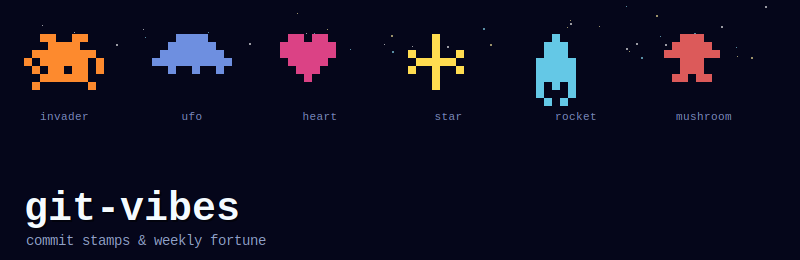

<p align="center">
  
</p>

<p align="center">
  
  
  
  
</p>

git運用にちょっとした遊び心を足す、小さい2つのツール。

- **stamp** — コミットのたびにランダムなドット絵が出る、pre-commitの儀式
- **fortune** — 直近7日のgit logから「今週の開発運勢」を占う

どちらもコミットを止めない・何もチェックしない・実行結果に関わらず`exit 0`。

---

## stamp — コミットスタンプ

<p align="center">
  
</p>

```bash
git clone https://github.com/UMEBOSHIISAN/git-vibes.git
cd <対象リポジトリ>
/path/to/git-vibes/install.sh
git commit -m "test"   # コミットのたびにドット絵が出る
```

`invader` `ufo` `heart` `star` `rocket` `mushroom` の6種からランダムに1つ表示。
稀に(8%)金色のレア版が出る（[m5-agent-stars](https://github.com/UMEBOSHIISAN/m5-agent-stars)の育成要素と同じ仕掛け）。

単体で試すだけなら:

```bash
python3 /path/to/git-vibes/stamp.py
```

---

## fortune — 今週の開発運勢

対象リポジトリのルートで実行:

```bash
python3 /path/to/git-vibes/fortune.py
```

直近7日のコミット数・深夜コミット率を見て、コメントとラッキーアイテム/カラーを表示する。
週番号でシードしているので、同じ週なら何度実行しても同じ結果になる。

```
🔮 今週の開発運勢
--------------------------------
コミット数     : 3
深夜コミット率  : 0/3

ゆるやかな週。小さな積み重ねが土台を作った。

今週のラッキーアイテム : 深呼吸
今週のラッキーカラー   : オレンジ
```

週次で見たいなら、cronではなく**自分で気が向いた時に手動実行**する運用を推奨
（このリポジトリの精神: 自動化は監視・強制ではなく、気分転換のためだけに使う）。

---

## 構成

```
git-vibes/
├── stamp.py       # ドット絵スタンプ本体
├── fortune.py     # 開発運勢占い本体
├── install.sh     # 対象リポジトリにpre-commitフックを設置
├── assets/
│   └── logo.svg
├── README.md
└── CHANGELOG.md
```

---

## ⚠️ Safety / Scope

**git-vibesはコミットを妨げません。品質ゲートでもCIチェックでもありません。**

- `stamp.py`/`fortune.py`はどちらも例外を握りつぶして`exit 0`で終わる。コミットをブロックする条件は存在しない
- コミットの中身は一切検査しない（lintでもテストランナーでもない）
- 生産性の評価・強制には使わない。コミット数が多い/少ないの優劣判定はしない
- fortuneの結果はエンタメ。意思決定材料にしない
- `install.sh`は`.git/hooks/pre-commit`を上書きする。既存フックがある場合はバックアップを取ってから上書きするか確認される

---

## 関連プロジェクト

- [m5-agent-stars](https://github.com/UMEBOSHIISAN/m5-agent-stars) — 同じドット絵・レア演出をM5StickC Plus実機でやるプロジェクト
- [chiptune-notify](https://github.com/UMEBOSHIISAN/chiptune-notify) — 同系統のチップチューン音源ライブラリ

---

## ライセンス

MIT — 遊び・実験用。xops / 本番 ops とは独立。
